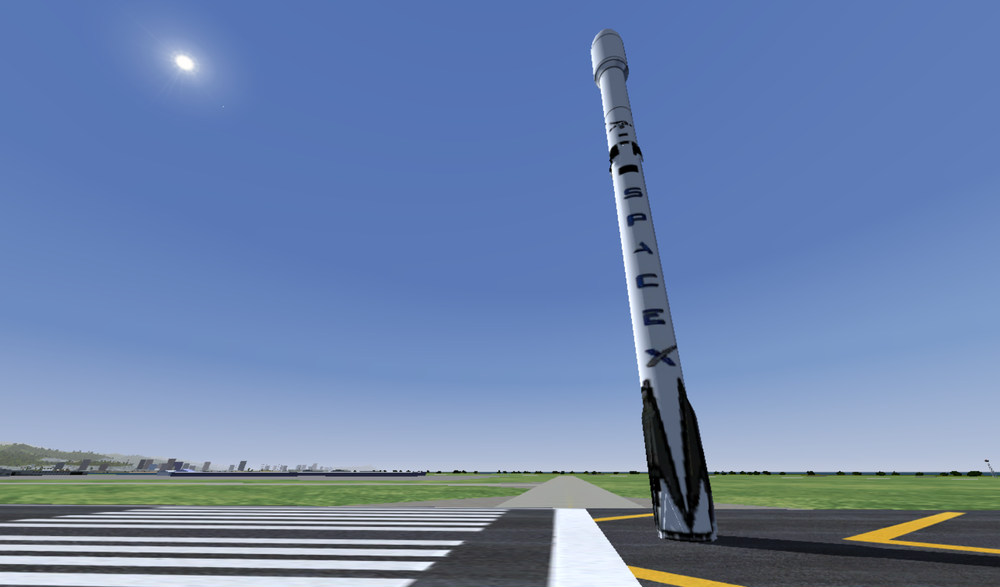
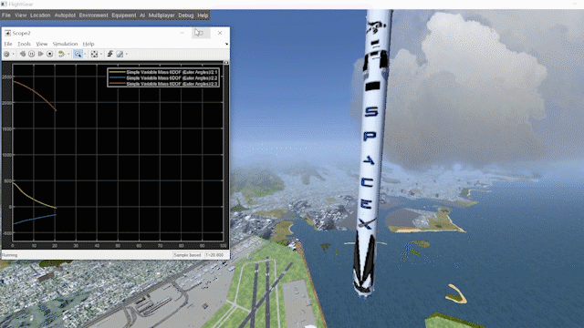

# 基于Simulink和Flightgear的猎鹰9号软着陆仿真

## 参考资料

Acikmese, B., Carson, J. M., & Blackmore, L. (2013). *Lossless Convexification of Nonconvex Control Bound and Pointing Constraints of the Soft Landing Optimal Control Problem. IEEE Transactions on Control Systems Technology, 21(6), 2104–2113.* doi:10.1109/tcst.2012.2237346 

Acikmese, B., & Ploen, S. R. (2007). *Convex Programming Approach to Powered Descent Guidance for Mars Landing. Journal of Guidance, Control, and Dynamics, 30(5), 1353–1366.* doi:10.2514/1.27553 

https://github.com/jonnyhyman/G-FOLD-Python

https://github.com/xdedss/GFOLD_KSP

## 软件配置

- MATLAB 2020a
- FlightGear 2019.1.2
- CVX（Matlab凸优化求解器）http://cvxr.com/cvx/

## 使用方法

1. 将falcon9文件夹复制到C:\Program Files\FlightGear 2019.1.2\data下（安装目录会有差异）
2. 运行runfg.bat脚本，开启FlightGear
3. 运行init.m，初始化参数（火星登陆器参数来自论文，猎鹰9参数来自github）
4. 运行cvx_solve.m，凸优化求解优化变量
5. 启动falcon9.slx的simulink仿真，guidance模块中的控制器利用凸优化求解出的位置、速度与真实的位置、速度的偏差和凸优化求解的推力，综合输出推力
6. 这里没有使用FlightGear自带的动力学模型，FlightGear只是用于可视化，动力学模型在Simulink中，是变质量的六自由度刚体模型，但输入力矩始终为0。

